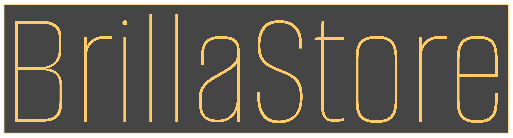

# [🔙](../README.md) Logos 🏞️

Estos logos preservan la identidad de la marca, así como sus casos de uso especificos.

## Logo

* **Uso principal:** Este logo minimalista debe utilizarse en situaciones donde se quiera un diseño simple o en lugares donde el espacio es limitado. Es ideal para favicons, marcas de agua, o elementos pequeños.

* **Colores:** Respetar siempre los colores de la paleta oficial. Se podrá realizar variaciones de logo en negro o en blanco para representaciones más formales.

* **Tamaño:** El tamaño del logo debe ser lo suficientemente grande para ser reconocible, al menos 250x250px.

## Logo con texto

* **Uso principal:** Este logo es preferido para situaciones formales o donde el reconocimento de la marca es esencial, como en cartas corporativas, sitios web, o comunicaciones oficiales.

* **Colores:** Siempre utilizar los colores oficiales del logo. Evitar distorsiones o variaciones de color que no estén aprobadas en la guía de marca.

* **Tamaño:** Mantener una legibilidad clara del texto. No usar en tamaños demasiado pequeños donde las letras puedan perderse.

## Logo con fondo

* **Uso principal:** Este logo con fondo debe emplearse en aplicaciones específicas donde el logo necesita destacarse claramente, por ejemplo, en banners, tarjetas de presentación, o material publicitario. El fondo permite que el logo sea visible sobre cualquier diseño o imagen.

* **Colores:** Usar el color de fondo predefinido. No modificar el color del fondo ni el del texto.

* **Tamaño:** Asegurarse de que el texto dentro del fondo siempre sea legible, respetando las proporciones del logo con el fondo. Evitar que el fondo se vea demasiado grande o desproporcionado en relación con el texto.
